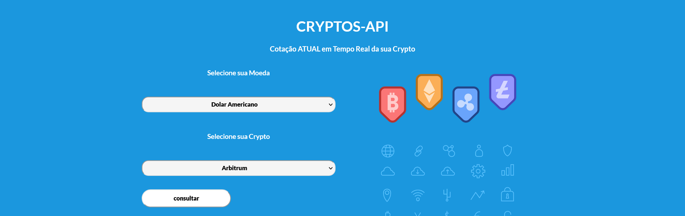
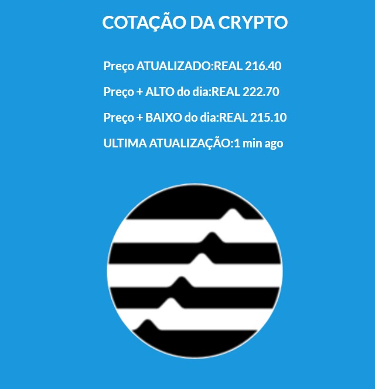

# PROJETO CRIPTOS
 [DEPLOY CRYPTOSAPI](https://cryptosapi.surge.sh/)

## OVERVIEW
Api frontend para consulta em tempo real da cotação das 20 principais cryptocoins do mundo em diferentes moedas do mundo a partir do consumo da api [CRYPTO COMPARE](https://www.cryptocompare.com/) em um front-end construido con react e styled-components sem nenhuma utilização de frameworks para estilização e seguindo boas praticas para um clean code.

## RECURSOS
- projeto inciializado com **VITE-REACT**
- estilização usando **styled-components**
- consumo de api  [CRYPTO COMPARE](https://www.cryptocompare.com/) por meio de metodos assincronicos usando **fetch**
- manipulação de dados em react usando como recurso principal  **React Hooks Personalizado**
- Recursos de aprendizagem - La Guía Completa: Hooks Context Redux MERN +15 Apps
    Nivel de habilidad: Nivel intermedio
    Estudiantes: 29705
    Idiomas: Español
    Subtítulos: Sí
    clases: 756
    Vídeo: 66,5 horas en total
    Professor: Juan Pablo De la torre Valdez

## RESULTADO
Logo da tela de inicio apresentada na primeira imagem o usuario realiza uma consulta que retorna como resultado:
- Preço atualizado da cryptomoeda em cotação local
- Preço + ALTO do dia
- Preço + Baixo do dia 
- Momento da ultima atualização 
- Imagem da crypto moeda buscada 

Data de Conclusão: 25/08/2023 - Projeto realizado em menos de 24hs para treinamento de habilidades adquiridas.

Agradecimentos Extras: 

[@ClaraMeirelles](https://github.com/ClaraMeirelles) - Instrutura que ensinou toda a base para react 

[@SuarezRocio](https://github.com/SuarezRocio) - Companheira de codigo e da vida sempre ajudando a melhorar e debugar 

Atenciosamente, Botechia-Erika.
